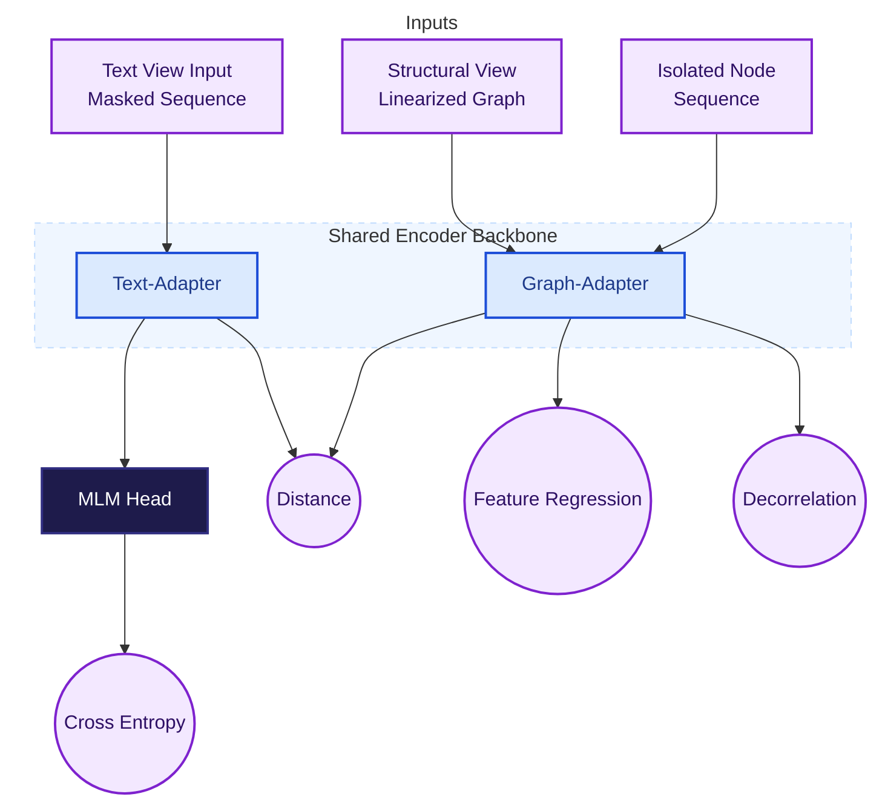

[Full technical documentation](scent-technical-doc.pdf)

# Scent: Constrained Generation Framework

Scent is a constrained generation framework for entity-linking that grounds textual output in structured graph knowledge. Scent utilizes an encoder backbone (e.g., RoBERTa) and introduces two specialized, simultaneously trained Low-Rank Adaptation (LoRA) modules:

- **Graph-adapter:** Designed to produce semantic representations of entities derived from structured information.
- **Text-adapter:** Manages the integration of textual context with structure-grounded entity slots.

## Framework Overview

The generation is **constrained**: the output must be selected from a pre-defined candidate set of entities, ensuring the text is grounded in the Knowledge Graph (KG).

### Dual-View Representation
The target entity is processed through two distinct but aligned views:

1.  **The Textual View:** Presents the target entity within its linguistic context. We prepare the sequence for prediction by defining the entity slot with entity boundary markers and a fixed buffer of mask tokens.
2.  **The Structural View:** Linearizes its local neighborhood (k-hop traversal) into a sequence of node and edge semantic units. We generate semantic representations directly from the text.

### Training Objectives
Scent employs a multi-task strategy to enforce consistency between the textual output and the underlying graph topology:

* **Textual Generation:** Using the **Text-Adapter**, we perform standard Masked Language Modeling on the tokens within the mask buffer.
* **Structure-Aware Feature Regression:** Using the **Graph-Adapter**, we apply a Masked Feature Regression on the sequence. The model must reconstruct the semantic vector of the masked target node solely from its structural context.
* **Cross-Modal Alignment:** To bridge the two views, we enforce a strict consistency constraint on the `<node_start>` token.
* **Representation Regularization:** We apply a decorrelation objective to the batch of predicted graph-view representations to penalize redundancy between feature dimensions.

## Inference and Constrained Generation

Scent introduces a high-efficiency inference mechanism designed to circumvent latency bottlenecks. We score all potential entities from the candidate set simultaneously in a single forward pass.

### 1. Offline Structural Indexing
Prior to inference, we construct a dense vector index of the Knowledge Graph using the Graph-Adapter. This map provides the "ground truth" semantic vectors against which text generation will be reranked.

### 2. Parallel Linguistic Evaluation
Scent evaluates the likelihood of the entire candidate vocabulary across all mask positions in parallel. We employ a highly optimized tensor "gather" operation to extract specific log-probabilities corresponding to the pre-tokenized sequences of the candidate set.

### 3. Cross-Modal Alignment and Re-ranking
Scent employs a **cascade re-ranking strategy**. We utilize the linguistic scores as a high-recall filter to prune the search space. The structural verification is computed exclusively for this reduced subset. We calculate the final score as a weighted combination of the linguistic probability and the cosine similarity between the predicted and actual graph vectors.

